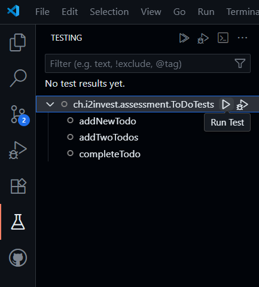

# Instructions

## Running the tests

To run the tests, execute the following command in your terminal:

```bash
mvn clean test
```

or via VS Code extension



## Final Steps

**Very Important:** Once you have completed the assessment, please commit and push your changes to the repository.
